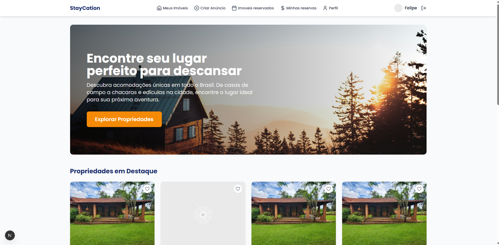
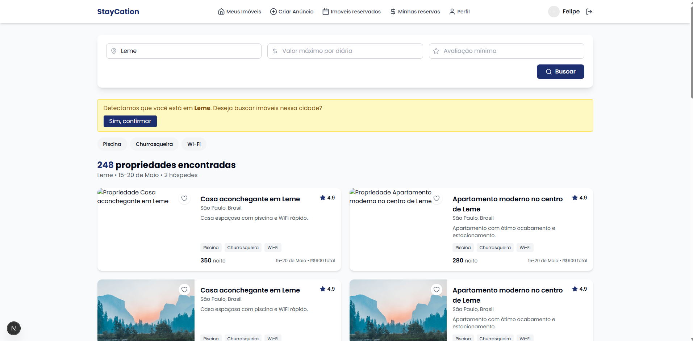
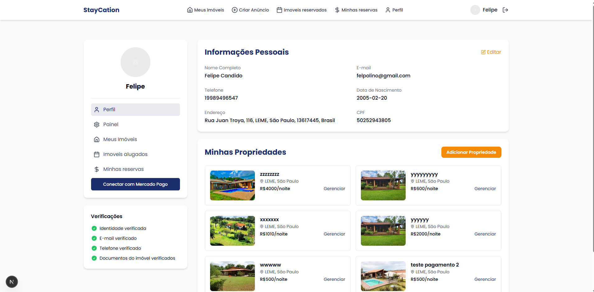

## Plataforma de Aluguéis de Espaços de Lazer (Chácaras, Edículas e mais)

Bem-vindo! Este repositório contém uma plataforma completa para anunciar, descobrir e reservar espaços de lazer, como chácaras, edículas e casas de campo. O projeto está dividido em um backend (Django + Django REST Framework) e um frontend (Next.js/React com Tailwind CSS).

### Capturas de tela





### Sumário

- Visão geral
- Principais funcionalidades
- Arquitetura e tecnologias
- Estrutura do projeto
- Como rodar (rápido com Docker ou manual)
- Variáveis de ambiente
- Scripts úteis
- Testes
- Convenções e contribuição

### Visão geral

O objetivo é facilitar o aluguel de espaços de lazer com uma experiência moderna e fluida:
- Anunciantes cadastram seus imóveis com fotos, descrição, comodidades e valores.
- Hóspedes pesquisam, filtram, visualizam detalhes e realizam reservas.
- Fluxo de pagamento integrado e painel de gerenciamento para proprietários e administradores.

### Principais funcionalidades

- Catálogo de propriedades com filtros (preço, localização, capacidade etc.).
- Página de detalhes com galeria de fotos, avaliações e políticas.
- Processo de reserva com confirmação e acompanhamento.
- Integração de pagamentos (ex.: Mercado Pago – chaves via .env).
- Painel do proprietário: gestão de anúncios, reservas e relatórios.
- Painel administrativo: aprovações e gestão de usuários.
- Autenticação/Autorização e recuperação de senha.

### Arquitetura e tecnologias

- Backend: Django, Django REST Framework, SQLite (dev). Estrutura de apps: `cadastro`, `imoveis`, `reservas`, `comentarios`, `pagamentos`.
- Frontend: Next.js (App Router), React, TypeScript, Tailwind CSS, Shadcn UI.
- Conteinerização: Docker e Docker Compose.

### Estrutura do projeto

```
backend/
  projeto/
    cadastro/           # Usuários e cadastros
    imoveis/            # Modelos e APIs de propriedades
    reservas/           # Lógica e APIs de reservas
    comentarios/        # Avaliações e comentários
    pagamentos/         # Integrações e serviços de pagamento
    projeto/            # Configurações Django (settings, urls, wsgi/asgi)
    manage.py           # Entrypoint Django
frontend/
  staycation-v2/        # Aplicação Next.js (App Router)
docker-compose.yml      # Orquestra backend/frontend (quando configurado)
```

### Como rodar

Você pode subir tudo via Docker (recomendado para testar rapidamente) ou rodar backend e frontend manualmente.

#### Opção A) Docker (rápido)

1) Tenha Docker e Docker Compose instalados.
2) Crie os arquivos `.env` conforme a seção "Variáveis de ambiente".
3) Na raiz do projeto:

```bash
docker compose up -d --build
```

4) Acesse:
- Backend (API): `http://localhost:8000`
- Frontend (Web): `http://localhost:3000`

Para parar:
```bash
docker compose down
```

Observação: o `docker-compose.yml` está na raiz. Ajuste variáveis de ambiente e volumes conforme sua necessidade.

#### Opção B) Manual (Windows/macOS/Linux)

Pré-requisitos: Python 3.11+, Node 18+, npm/pnpm, SQLite (dev), Git.

1) Backend (Django)

```bash
# Na raiz do repositório
cd backend

# (Opcional) Criar e ativar venv se ainda não estiver ativa
python -m venv venv
./venv/Scripts/activate   # Windows PowerShell
# source venv/bin/activate # macOS/Linux

# Instalar dependências
pip install -r requirements.txt

# Migrar banco e criar superusuário
python projeto/manage.py migrate
python projeto/manage.py createsuperuser

# Rodar servidor
python projeto/manage.py runserver 0.0.0.0:8000
```

API disponível em `http://localhost:8000`.

2) Frontend (Next.js)

```bash
cd frontend/staycation-v2
npm install     # ou pnpm install / yarn
npm run dev
```

Aplicação web em `http://localhost:3000`.

### Variáveis de ambiente

Crie um arquivo `.env` em `frontend/staycation-v2/` e configure:

```env
NEXT_PUBLIC_API_BASE_URL=http://localhost:8000
NEXT_PUBLIC_APP_NAME=Staycation
```

No backend, utilize um arquivo `.env` (ou variáveis do sistema) para chaves sensíveis. O projeto possui `tokens.env` e integrações de pagamento. Exemplo (ajuste conforme seu provedor):

```env
DJANGO_SECRET_KEY=troque-por-uma-chave-secreta
DJANGO_DEBUG=True
DJANGO_ALLOWED_HOSTS=localhost,127.0.0.1

# Banco (dev padrão: SQLite)

# Pagamentos (ex.: Mercado Pago)
MP_PUBLIC_KEY=sua-public-key
MP_ACCESS_TOKEN=seu-access-token

# E-mail/SMTP (opcional)
EMAIL_HOST=smtp.seuprovedor.com
EMAIL_PORT=587
EMAIL_HOST_USER=usuario
EMAIL_HOST_PASSWORD=senha
EMAIL_USE_TLS=True
```

Verifique `backend/projeto/projeto/settings.py` e `backend/projeto/pagamentos/services.py` para conferir como as variáveis são lidas.

### Scripts úteis

- Rodar linter (se configurado no frontend):
```bash
cd frontend/staycation-v2 && npm run lint
```

- Build de produção (frontend):
```bash
cd frontend/staycation-v2 && npm run build && npm run start
```

- Popular base ou comandos customizados (se existirem):
```bash
python backend/projeto/manage.py help
```

### Testes

Backend (Django):
```bash
cd backend
./venv/Scripts/activate   # Windows
python projeto/manage.py test
```

Frontend (se houver testes configurados):
```bash
cd frontend/staycation-v2
npm test
```

### Endpoints (exemplos)

Algumas rotas típicas (podem variar conforme `urls.py` de cada app):
- `GET /api/imoveis/` – lista propriedades
- `GET /api/imoveis/{id}/` – detalhes
- `POST /api/reservas/` – cria reserva
- `GET /api/reservas/` – lista reservas do usuário
- `POST /api/pagamentos/checkout/` – inicia pagamento

Consulte os arquivos `urls.py` e a documentação interna da API para detalhes.

### Convenções e contribuição

- Commits descritivos (Português claro) e PRs pequenos e focados.
- Siga o style guide do projeto (TypeScript/React no frontend e PEP8 no backend).
- Issues e sugestões são bem-vindas.

### Licença

Defina a licença do seu projeto (MIT/Apache-2.0/GPL-3.0, etc.). Caso não haja uma, todos os direitos são reservados ao autor.

—

Em caso de dúvidas, abra uma issue. Bom código e boas reservas!